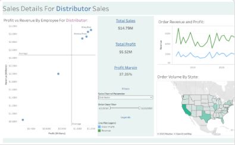

<h1>Hi, I'm Cole! </h1>

 I'm a Graduate Student in Data Science... 

<h2>👨‍💻 Data Analytics Projects:</h2>

- <b>Data Structures and Algorithms Practice (AlgoExpert)</b>
  - 
<!--
**joshmadakor1/joshmadakor1** is a ✨ _special_ ✨ repository because its `README.md` (this file) appears on your GitHub profile.

Here are some ideas to get you started:

- 🔭 I’m currently working on ...
- 🌱 I’m currently learning ...
- ⚡ Fun fact: ...
-->
